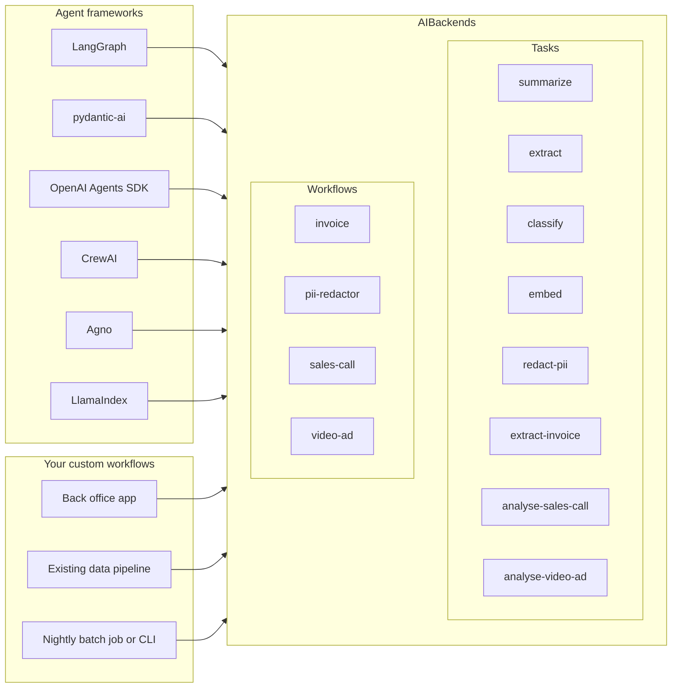

# AIBackends

Framework-agnostic AI tasks and pipelines, powered by pluggable runtimes.

AIBackends is a Python library of ready-made AI tasks and workflows that are not
tied to any one agent framework. Use the same configured tasks and pipelines in
LangGraph, pydantic-ai, OpenAI Agents SDK, CrewAI, Agno, LlamaIndex, or your own
application code. Extract invoices, redact PII, classify documents, analyse
sales calls, and analyse video ads with typed results.

```python
from aibackends.models import GEMMA4_E2B
from aibackends.runtimes import LLAMACPP
from aibackends.tasks import ExtractInvoiceTask, create_task

task = create_task(
    ExtractInvoiceTask,
    runtime=LLAMACPP,
    model=GEMMA4_E2B,
)

result = task.run("invoice.pdf")
print(result.total)
```

## Why AIBackends

- Framework agnostic: keep workflows and pipelines independent of whichever agent framework you use today
- Easy to switch or mix frameworks: wrap the same task or workflow object for LangGraph, pydantic-ai, OpenAI Agents SDK, CrewAI, Agno, LlamaIndex, or your own code
- Local-first: first-class support for `llama-cpp-python` and `transformers`
- Typed outputs: every structured task returns a Pydantic model
- Optional orchestration: workflows add retries, steps, and batch execution without forcing a framework




Agents from any framework and your own custom workflows, apps, and batch jobs
all call into the same AIBackends tasks and workflows. Swap agent frameworks
or add new consumers without rewriting the underlying extraction,
classification, redaction, or analysis logic.

## Core Concepts

- A `task` is the user-facing function, such as `extract_invoice(...)` or `redact_pii(...)`.
- A `runtime` is a general LLM or embedding executor with `complete(...)` and `embed(...)`, such as `llamacpp`, `transformers`, `ollama`, or `anthropic`.
- A `backend` is a swappable implementation for one capability. PII detection uses backends such as `gliner` and `openai-privacy`.
- A `model` is the artifact or profile used by a runtime or backend, such as `google/gemma-4-E2B-it`, `nvidia/gliner-pii`, or `openai/privacy-filter`.

## Install

```bash
pip install aibackends

# Local runtimes
pip install aibackends[llamacpp]
pip install aibackends[llamacpp-cuda]
pip install aibackends[llamacpp-metal]
pip install aibackends[transformers]

# Capability extras
pip install aibackends[pdf]
pip install aibackends[audio]
pip install aibackends[video]
pip install aibackends[pii]
```

Downloaded local models for `llamacpp` and `aibackends pull` go into the standard Hugging Face cache by default, usually `~/.cache/huggingface/hub`.

If you want to inspect or clean up downloaded models:

```bash
cd ~/.cache/huggingface/hub
```

## Quickstart

```python
from aibackends.models import GEMMA4_E2B
from aibackends.runtimes import LLAMACPP
from aibackends.tasks import ClassifyTask, RedactPIITask, SummarizeTask, create_task

summarizer = create_task(SummarizeTask, runtime=LLAMACPP, model=GEMMA4_E2B)
classifier = create_task(
    ClassifyTask,
    runtime=LLAMACPP,
    model=GEMMA4_E2B,
    labels=["invoice", "contract", "receipt"],
)
redactor = create_task(
    RedactPIITask,
    backend="gliner",
    labels=["email", "phone_number"],
)

summary = summarizer.run("notes.txt")
classification = classifier.run("invoice text")
redacted = redactor.run("john@example.com called from +1 555 0100")
```

`redact_pii` uses its own PII detection backend such as `gliner` or `openai-privacy`; it does not use the `configure()` runtime/model settings. GLiNER and `openai/privacy-filter` are models, but in AIBackends they are used through PII backends rather than through the general LLM runtime interface. When using `gliner`, you can pass custom entity labels with `labels=[...]`.

## Tasks

```python
from aibackends.tasks import (
    BaseTask,
    SummarizeTask,
    create_task,
    analyse_sales_call,
    analyse_video_ad,
    classify,
    embed,
    extract,
    extract_invoice,
    redact_pii,
    summarize,
)
```

Direct function calls are the simplest API. The same tasks are also available as
configured `BaseTask` objects through the factory, using the exported task
classes for autocomplete-friendly discovery:

```python
from aibackends.models import GEMMA4_E2B
from aibackends.runtimes import LLAMACPP
from aibackends.tasks import SummarizeTask, create_task

task = create_task(
    SummarizeTask,
    runtime=LLAMACPP,
    model=GEMMA4_E2B,
)
summary = task.run("notes.txt")
```

Included structured outputs:

- `InvoiceOutput`
- `SalesCallReport`
- `VideoAdReport`
- `RedactedText`
- `Classification`

## Runtimes

Preferred per-object configuration:

```python
from aibackends.models import GEMMA4_E2B
from aibackends.runtimes import LLAMACPP
from aibackends.tasks import ExtractInvoiceTask, create_task

task = create_task(ExtractInvoiceTask, runtime=LLAMACPP, model=GEMMA4_E2B)
```

Direct function calls can still override runtime settings per call:

```python
from aibackends.models import CLAUDE_SONNET_4_5
from aibackends.runtimes import ANTHROPIC
from aibackends.tasks import extract_invoice

result = extract_invoice("invoice.pdf", runtime=ANTHROPIC, model=CLAUDE_SONNET_4_5)
```

You can also use `configure(...)` for global defaults when that fits your app.

Use `available_runtimes()` and `available_models()` to inspect the curated
runtime and model catalog exposed by the Python API.

Python code should pass typed refs like `LLAMACPP` and `GEMMA4_E2B`; string
names remain supported at text boundaries such as the CLI and YAML config.

Supported runtimes:

- `llamacpp`
- `transformers`
- `ollama`
- `lmstudio`
- `anthropic`
- `together`
- `groq`

For local `transformers` models, prompt rendering is configurable:

```python
from aibackends.models import GEMMA3_270M_IT
from aibackends import configure
from aibackends.runtimes import TRANSFORMERS

configure(
    runtime=TRANSFORMERS,
    model=GEMMA3_270M_IT,
    prompt_format="auto",  # auto | chat_template | text
)
```

`prompt_format="auto"` uses an inline or file-based override first, then the tokenizer's own chat template, and finally plain text as a fallback. You can force a custom template with `chat_template="..."` or `chat_template_path="template.jinja"`.

## Workflows

```python
from pathlib import Path

from aibackends.models import GEMMA4_E2B
from aibackends.runtimes import LLAMACPP
from aibackends.workflows import SalesCallAnalyser, create_workflow

workflow = create_workflow(
    SalesCallAnalyser,
    runtime=LLAMACPP,
    model=GEMMA4_E2B,
)

results = workflow.run_batch(
    inputs=Path("./calls").glob("*.m4a"),
    max_concurrency=4,
    on_error="collect",
)
```

Included workflows:

- `InvoiceProcessor`
- `SalesCallAnalyser`
- `VideoAdIntelligence`
- `PIIRedactor`

## Examples

See `examples/README.md` for setup and usage.

Runnable core examples with bundled sample data:

- `examples/list_available.py`
- `examples/tasks/basic_task.py`
- `examples/tasks/basic_task_transformers.py`
- `examples/tasks/summarize_text.py`
- `examples/tasks/classify_text.py`
- `examples/tasks/redact_text.py`
- `examples/tasks/extract_custom_schema.py`
- `examples/tasks/task_interface.py`
- `examples/tasks/sales_call_report.py`
- `examples/tasks/video_ad_report.py`
- `examples/workflows/batch_processing.py`
- `examples/workflows/custom_pipeline.py`
- `examples/workflows/resume_redact_summarize.py`
- `examples/workflows/resume_role_match.py`

Framework integration examples:

- `examples/agents/langgraph_agent.py`
- `examples/agents/pydantic_ai_agent.py`
- `examples/agents/openai_agents_sdk.py`
- `examples/agents/crewai_agent.py`
- `examples/agents/agno_agent.py`
- `examples/agents/llamaindex_agent.py`

## CLI

```bash
aibackends task extract-invoice --input invoice.pdf
aibackends task redact-pii --input transcript.txt --backend gliner --labels email,phone_number,user_name
aibackends task classify --input doc.txt --labels invoice,contract,receipt
aibackends pull gemma4-e2b --runtime llamacpp
aibackends check transformers
```

See the [CLI guide](docs/cli.md) for the full command reference, per-task
examples, output formats, and what is and isn't exposed via the CLI.

## Repo layout

```text
src/aibackends/
  backends/
  core/
  model_support/
  models/
  schemas/
  steps/
  tasks/
  workflows/
  cli.py
examples/
docs/
tests/
```

## Docs

The docs are intentionally small:

- `docs/concepts.md`: task, runtime, backend, model, and workflow vocabulary
- `docs/usage.md`: install, configure, tasks, workflows, and agent integrations
- `docs/cli.md`: command reference for `aibackends task`, `pull`, and `check`
- `docs/extending.md`: add runtimes, model profiles, capability backends, tasks, and workflows
- `docs/api-reference/index.md`: public API groups

## Development

```bash
python3 -m pip install -e ".[dev]"
python3 -m pytest tests
python3 -m mypy src tests
ruff check .
```

See `CONTRIBUTING.md` for task, workflow, and runtime contribution guidelines.