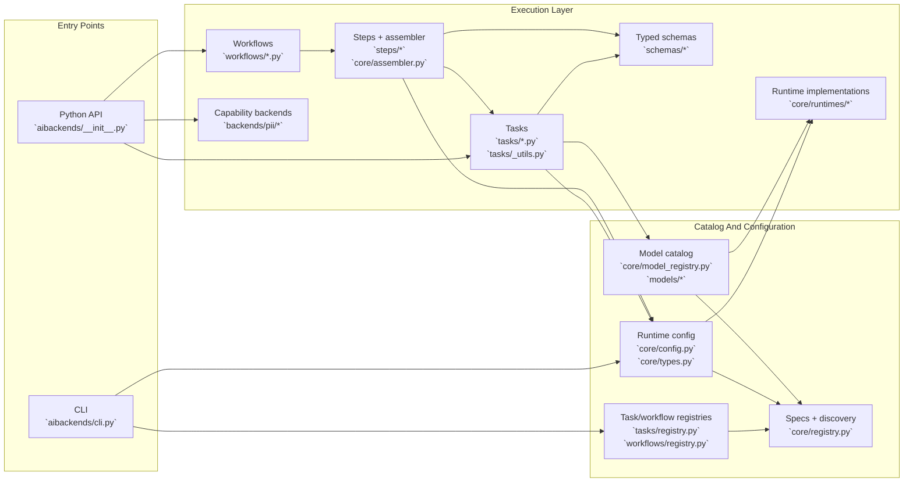

# Architecture

This page maps the main code paths in `aibackends` so it is easier to navigate
the package, reason about request flow, and choose the right extension point.
For terminology such as task vs runtime vs backend, see
[Concepts](concepts.md). For step-by-step extension instructions, see
[Extending](extending.md).

## Big Picture

`aibackends` is organized around a small set of stable contracts:

- tasks are the user-facing units of work
- workflows orchestrate reusable steps
- runtimes execute general LLM and embedding calls
- model profiles map supported model refs to runtime-specific model ids
- capability backends handle focused non-runtime features such as PII detection

The code architecture centers on those contracts rather than on any one agent
framework. Framework integrations live outside the main package and call into
these plain Python APIs.

## Package Map

| Area                | Main paths                                                                               | Responsibility                                                                                               |
| ------------------- | ---------------------------------------------------------------------------------------- | ------------------------------------------------------------------------------------------------------------ |
| Public API          | `src/aibackends/__init__.py`                                                             | Re-exports configuration helpers, discovery helpers, and the direct task functions.                          |
| CLI                 | `src/aibackends/cli.py`                                                                  | Runs named tasks, checks runtimes, and pulls models from the terminal.                                       |
| Shared contracts    | `src/aibackends/core/registry.py`                                                        | Defines `RuntimeSpec`, `TaskSpec`, `WorkflowSpec`, `ModelRef`, and discovery helpers.                        |
| Runtime config      | `src/aibackends/core/config.py`, `src/aibackends/core/types.py`                          | Merges global defaults with per-call overrides and instantiates runtimes.                                    |
| Tasks               | `src/aibackends/tasks/`                                                                  | Implements user-facing units of work and common task helpers such as prompt building and validation retries. |
| Workflows           | `src/aibackends/workflows/`, `src/aibackends/steps/`, `src/aibackends/core/assembler.py` | Composes reusable steps into pipelines with shared runtime context and batch execution.                      |
| Runtimes            | `src/aibackends/core/runtimes/`, `src/aibackends/runtimes.py`                            | Provides concrete LLM and embedding executors behind the `BaseRuntime` contract.                             |
| Models              | `src/aibackends/models/`, `src/aibackends/core/model_registry.py`                        | Exposes supported model refs and resolves them to runtime-specific model profiles.                           |
| Schemas             | `src/aibackends/schemas/`                                                                | Holds Pydantic types for structured task and workflow outputs.                                               |
| Capability backends | `src/aibackends/backends/pii/`                                                           | Hosts non-runtime pluggable implementations for focused features such as PII detection.                      |
| Model preparation   | `src/aibackends/core/model_manager.py`, `src/aibackends/model_support/`                  | Handles pull and ensure-model flows used by the CLI and runtime helpers.                                     |

## Typical Request Flow

### Task Calls

1. Application code calls a task function such as `summarize(...)` or creates a
  configured task via `create_task(...)`.
2. The task module builds prompts and delegates to shared helpers in
  `src/aibackends/tasks/_utils.py`.
3. Those helpers call `resolve_runtime_config(...)` to merge:
  - global defaults from `configure(...)` or `load_config(...)`
  - per-call runtime/model overrides
  - extra execution options such as retries or generation settings
4. `get_runtime(...)` resolves the configured runtime name through the
  discovered `RuntimeSpec` registry and returns a `BaseRuntime` instance.
5. The runtime executes `complete(...)` or `embed(...)`.
6. The task helper parses the runtime response, validates structured output when
  needed, emits task logs, and returns the final Python value.

### Workflow Calls

1. Application code instantiates a workflow class or uses
  `create_workflow(...)`.
2. `Pipeline.__init__` resolves the runtime configuration once and builds an
  `Assembler`.
3. `Assembler.run(...)` walks through the workflow's `BaseStep` objects in
  order, passing a shared `StepContext`.
4. Steps that need an LLM use that shared runtime context and usually call the
  same task helpers or `create_task(...)`, so workflows reuse the task/runtime
   stack instead of inventing a second execution path.

## Registry And Discovery Model

The codebase uses file-based discovery so built-in capabilities stay visible as
modules instead of being hidden in one large registry file.

- `discover_specs(...)` in `src/aibackends/core/registry.py` scans a package and
collects exported spec values such as `RUNTIME_SPEC`, `TASK_SPEC`, and
`WORKFLOW_SPEC`.
- `src/aibackends/core/config.py` discovers runtimes from
`src/aibackends/core/runtimes/`.
- `src/aibackends/tasks/registry.py` and
`src/aibackends/workflows/registry.py` discover built-in tasks and workflows
from their packages.
- `src/aibackends/core/model_registry.py` discovers model profiles from
`src/aibackends/models/`.

This gives the project two useful properties:

- adding a new built-in capability usually means adding one focused file
- the public catalog can still be queried through helpers such as
`available_tasks()`, `available_workflows()`, `available_runtimes()`, and
`available_models()`

## Configuration Boundaries

The code now draws a deliberate line between Python APIs and text boundaries.

- Python-facing entry points use typed runtime and model refs such as
`LLAMACPP` and `GEMMA4_E2B`.
- CLI flags and YAML config stay string-based because they are text interfaces.
- Boundary parsing happens before those string values enter the stricter Python
path.

That split keeps Python code discoverable and typo-resistant without making the
CLI or config files awkward to use.

## Extension Points

The main extension seams match the package layout:

| Add this           | Main files                          | Notes                                                                                                                                |
| ------------------ | ----------------------------------- | ------------------------------------------------------------------------------------------------------------------------------------ |
| Runtime            | `src/aibackends/core/runtimes/*.py` | Export `RUNTIME_SPEC` and implement the `BaseRuntime` contract.                                                                      |
| Model profile      | `src/aibackends/models/*.py`        | Export `MODEL_PROFILE` or `MODEL_PROFILES` and re-export the public `ModelRef` from `src/aibackends/models/__init__.py` when needed. |
| Task               | `src/aibackends/tasks/*.py`         | Implement `BaseTask`, add any schema under `src/aibackends/schemas/`, and export `TASK_SPEC`.                                        |
| Workflow           | `src/aibackends/workflows/*.py`     | Subclass `Pipeline`, compose `BaseStep` objects, and export `WORKFLOW_SPEC`.                                                         |
| Workflow step      | `src/aibackends/steps/*`            | Add a reusable `BaseStep` when logic belongs in orchestration instead of in one task.                                                |
| Capability backend | `src/aibackends/backends/pii/*`     | Use a focused backend spec rather than the general runtime contract for feature-specific integrations.                               |

## What Is Outside The Core

The `examples/` directory shows how to wrap tasks and workflows for LangGraph,
CrewAI, pydantic-ai, OpenAI Agents SDK, Agno, and LlamaIndex. Those examples are
important, but they are adapter code, not part of the core execution
architecture described above.